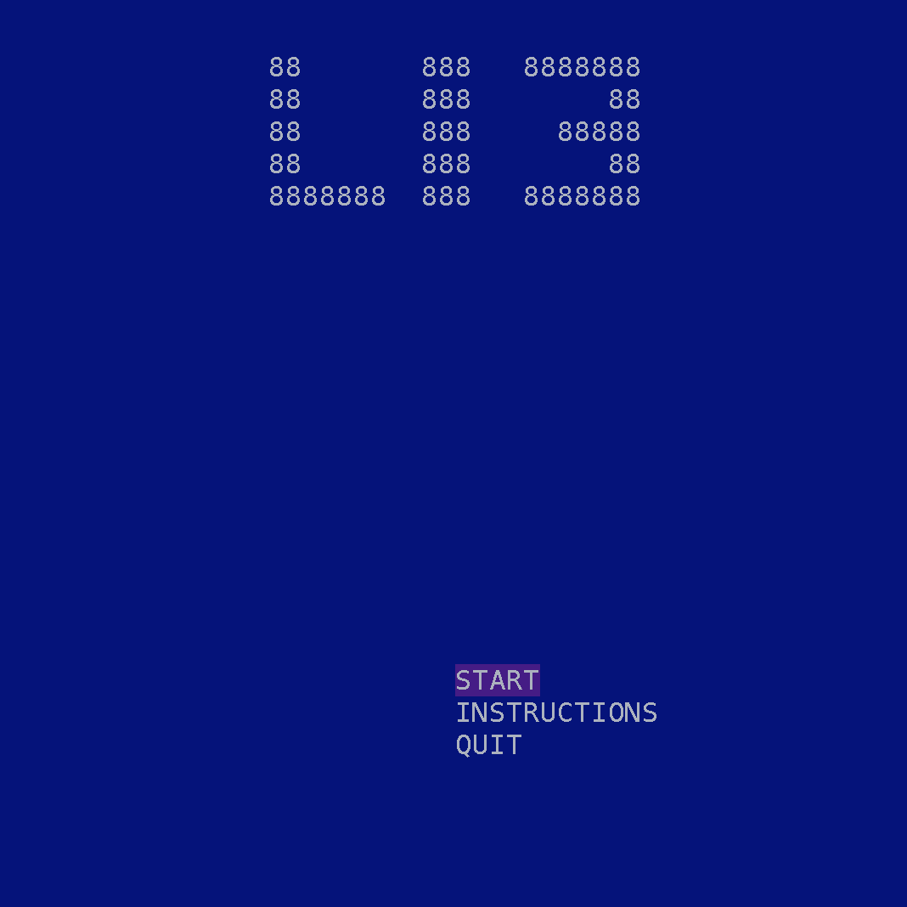
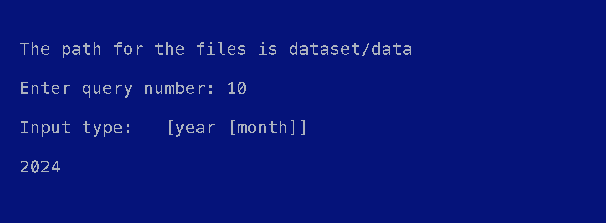
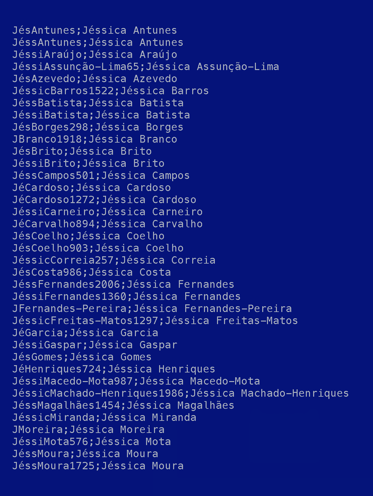
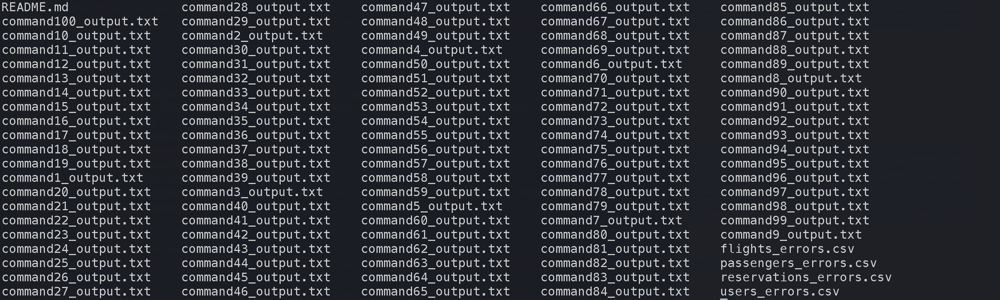

<h1 align="center">Laboratórios de Informática III </h1>

<h3 align="center"> Made using the C programming language and heavy usage of GLib data structures during the 1st semester of the 2nd year</h3> 

<h1 align="center">Final Grade: 18/20💫</h1>

<h1>About</h1> 
This project aimed to parse data from .csv files, interpret said data, and provide queries for the user to manipulate and understand certain aspects of the database, obtaining key insights in the process.

## Usage
#### Batch mode: 
```bash
./programa-principal <input_folder> <command_file>
```
#### Test mode: 
```bash
./programa-testes <input_folder> <command_file> <expected_output_folder>
```
#### Interactive mode: 
```bash
./programa-principal
```

<h2>Features</h2>
    <ul>
        <li>Data parsing: Read and interpret .csv files.</li>
        <li>Argument validation: Assuring correct format and inputs provided by the database.</li>
        <li>Query system: Allow users to choose from a predetermined list of queries.</li>
    </ul>

## Preview

<h3 align="center"> Main interactive menu</h3> 



#

<h3 align="center"> Interactive example input</h3> 



#

<h3 align="center"> Interactive example output</h3> 



#

<h3 align="center"> Batch example output</h3> 



#

<h3 align="center"> Automatic testing website results</h3> 


<h4 align="center">Our group was 1 of 23 that finished with a perfect mark on all parameters, out of a total of 99 groups</h4> 


<h2>Installation</h2>

```bash
$ git clone https://www.github.com/2101dudu/Booking-LI3

$ cd trabalho-pratico

$ make
```

## Group 47
The members of this group who contributed to this project were:
- <a href="https://www.github.com/Cerqueira025">Ana Cerqueira</a>
- <a href="https://www.github.com/2101dudu">Eduardo Faria</a>
- <a href="https://www.github.com/NunoMRS7">Nuno Silva</a>

